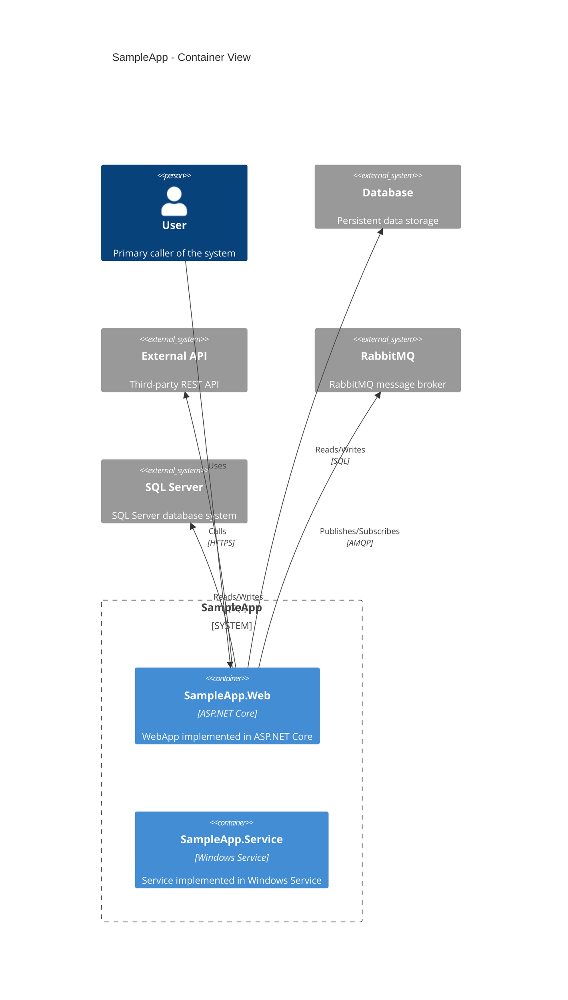

# C4 Container

**Generated**: 2026-02-20 22:34:41

## Summary

- System: SampleApp
- Containers detected: 2
- Relationships detected: 0
- External systems mapped: 4

## Diagram

---

**Generated by AppDoc Framework**