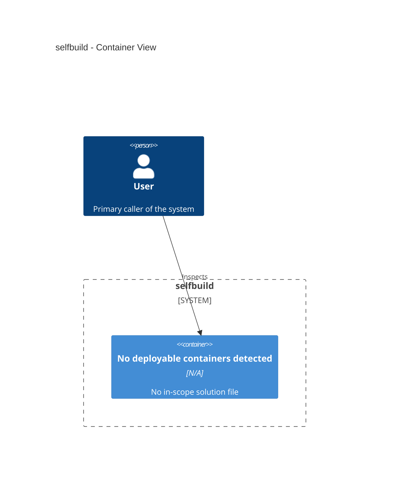

# C4 Container

**Generated**: 2026-10-23 01:55:37

## Summary

- System: selfbuild (repository root)
- Containers detected: 0
- Relationships detected: 0
- Note: no in-scope .NET solution file found; no deployable containers detected

## Diagram

```mermaid
C4Container
title selfbuild - Container View
Person(user, "User", "Primary caller of the system")
System_Boundary(system_boundary, "selfbuild") {
  Container(no_containers, "No deployable containers detected", "N/A", "No in-scope solution file")
}
Rel(user, no_containers, "Inspects")
```

---

**Generated by AppDoc Framework**

## Provenance

- Generator Version: appdoc-run-all-generators/3.0.0
- Commit Hash: 17cdd36
- Generated At: 2026-10-23T01:55:45-04:00
- Profile: default
- Scope: .
- Confidence/Inference Flags: deterministic, evidence-backed
