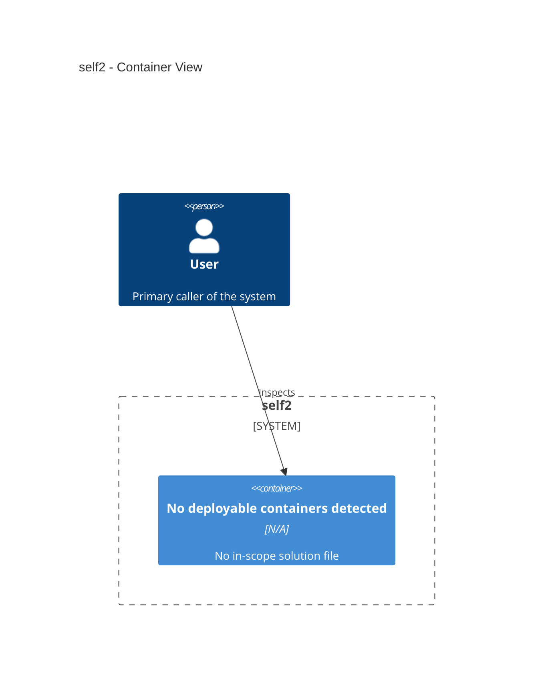

# C4 Container

**Generated**: 2026-10-23 15:18:17

## Summary

- System: self2 (repository root)
- Containers detected: 0
- Relationships detected: 0
- Note: no in-scope .NET solution file found; no deployable containers detected

## Diagram

```mermaid
C4Container
title self2 - Container View
Person(user, "User", "Primary caller of the system")
System_Boundary(system_boundary, "self2") {
  Container(no_containers, "No deployable containers detected", "N/A", "No in-scope solution file")
}
Rel(user, no_containers, "Inspects")
```

---

**Generated by AppDoc Framework**

## Provenance

- Generator Version: appdoc-run-all-generators/3.0.0
- Commit Hash: 5e53b62
- Generated At: 2026-10-23T15:18:23+00:00
- Profile: default
- Scope: .
- Confidence/Inference Flags: deterministic, evidence-backed
