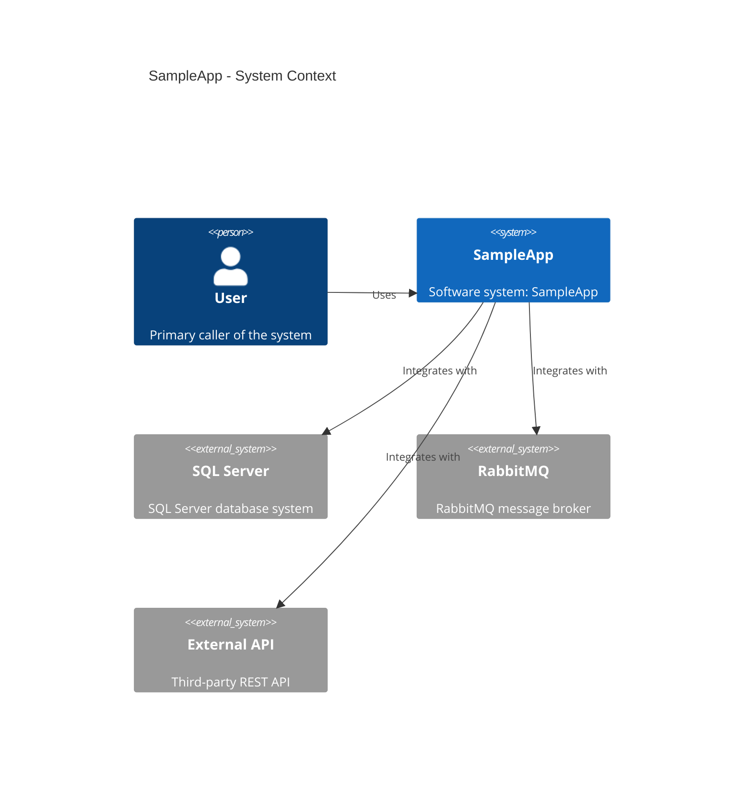

# C4 System Context

**Generated**: 2026-02-20 22:34:41

## Summary

- System: SampleApp
- External systems detected: 4
- Scope: high-level system context

## Diagram

---

**Generated by AppDoc Framework**