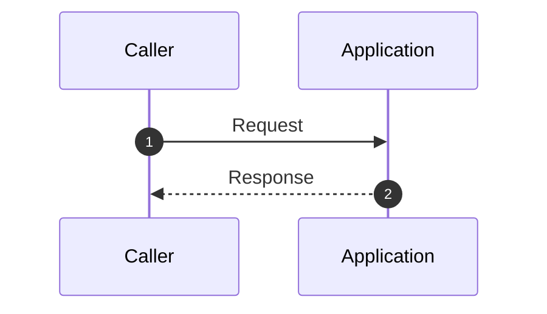

# Critical Sequences

_Generated: 2026-02-25 14:48:58_

## What This View Explains

This artifact captures the highest-signal runtime request journeys from deterministic evidence so teams can review end-to-end behavior quickly.

No high-confidence request journeys were available for scenario rendering in this scan.
Evidence was scanned (cfg-0001, cfg-0002, cfg-0003, cfg-0004, cfg-0005, cfg-0006, cfg-0007, cfg-0008, cfg-0009) but was insufficient for reconstructing high-confidence request journeys.

## Baseline Sequence

## Evidence Refs

- cfg-0001
- cfg-0002
- cfg-0003
- cfg-0004
- cfg-0005
- cfg-0006
- cfg-0007
- cfg-0008
- cfg-0009

