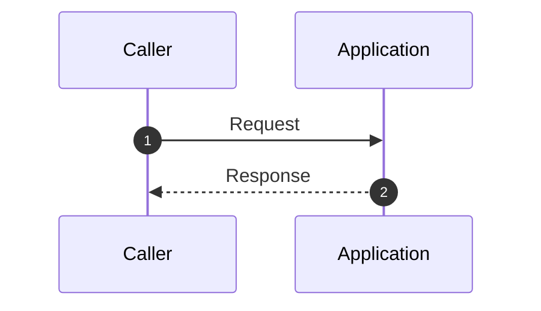

# Critical Sequences

_Generated: 2026-03-11 15:01:53_

## What This View Explains

This artifact captures the highest-signal runtime request journeys from deterministic evidence so teams can review end-to-end behavior quickly.

No high-confidence request journeys were available for scenario rendering in this scan.

## Baseline Sequence

## Evidence Refs

- No evidence references captured in this run.

