# Data Flow Diagram

_Generated: 2026-03-04 15:09:02_

## What This View Explains

This view traces input sources, processing transformations, and output channels so teams can reason about data movement and side effects.

## Diagram

```mermaid
flowchart LR
    %% Solid edges: runtime request/data flow. Dashed edges: structural/config/dependency links.
    subgraph inputs["Input Boundary"]
        config_github_copilot_chat_ex_3233c7ea["github.copilot.chat.executions.enabled"]
        config_jobs_syntax_gate_runs_1cc1bd48["jobs.syntax-gate.runs-on"]
        config_jobs_syntax_gate_steps_b0ed346a["jobs.syntax-gate.steps.shell"]
        config_jobs_syntax_gate_steps_c21bece1["jobs.syntax-gate.steps(0)"]
        config_jobs_syntax_gate_steps_f955e977["jobs.syntax-gate.steps(1)"]
        config_jobs_syntax_gate_steps_fea78b6a["jobs.syntax-gate.steps(2)"]
        config_name_6ae99955["name"]
        config_on_push_branches_0_2a450bbd["on.push.branches(0)"]
        config_on_push_branches_1_81342622["on.push.branches(1)"]
    end
    subgraph processing["Core Transformations"]
        component_core_processing_6d28d771["Core Processing"]
    end
    class component_core_processing_6d28d771 component
    class config_github_copilot_chat_ex_3233c7ea config
    class config_jobs_syntax_gate_runs_1cc1bd48 config
    class config_jobs_syntax_gate_steps_b0ed346a config
    class config_jobs_syntax_gate_steps_c21bece1 config
    class config_jobs_syntax_gate_steps_f955e977 config
    class config_jobs_syntax_gate_steps_fea78b6a config
    class config_name_6ae99955 config
    class config_on_push_branches_0_2a450bbd config
    class config_on_push_branches_1_81342622 config
classDef actor fill:#0f172a,stroke:#0f172a,color:#ffffff,stroke-width:1px
classDef inbound fill:#dcfce7,stroke:#166534,color:#166534,stroke-width:1px
classDef outbound fill:#ffedd5,stroke:#9a3412,color:#9a3412,stroke-width:1px
classDef component fill:#dbeafe,stroke:#1d4ed8,color:#1d4ed8,stroke-width:1px
classDef data fill:#fef9c3,stroke:#854d0e,color:#854d0e,stroke-width:1px
classDef config fill:#f5f3ff,stroke:#5b21b6,color:#5b21b6,stroke-width:1px
classDef external fill:#fee2e2,stroke:#991b1b,color:#991b1b,stroke-width:1px
classDef dependency fill:#ede9fe,stroke:#4338ca,color:#4338ca,stroke-width:1px
```

## Reading Notes

- Solid arrows represent deterministic code-evidenced relationships.
- Nodes are filtered and ordered for readability; full detail remains in evidence artifacts.
- Coverage snapshot: 10 nodes, 0 edges, 0 inbound interfaces, 0 outbound integrations.

## Evidence Refs

- cfg-0001
- cfg-0002
- cfg-0003
- cfg-0004
- cfg-0005
- cfg-0006
- cfg-0007
- cfg-0008
- cfg-0009

