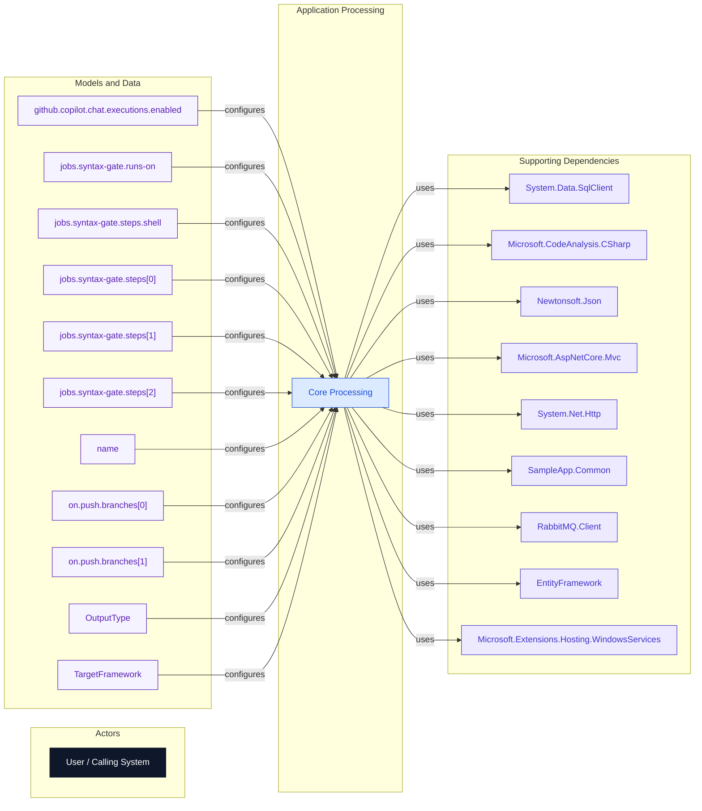

# Internal Flow Diagram

_Generated: 2026-02-20 14:53:50_

## What This View Explains

This view shows how requests move from callers into core processing components and then to data models or external integrations.

## Diagram

## Reading Notes

- Solid arrows represent deterministic code-evidenced relationships.
- Nodes are filtered and ordered for readability; full detail remains in evidence artifacts.
- Coverage snapshot: 22 nodes, 20 edges, 0 inbound interfaces, 0 outbound integrations.

## Evidence Refs

- cfg-0001
- cfg-0002
- cfg-0003
- cfg-0004
- cfg-0005
- cfg-0006
- cfg-0007
- cfg-0008
- cfg-0009
- cfg-0010
- cfg-0011
- cfg-0012

