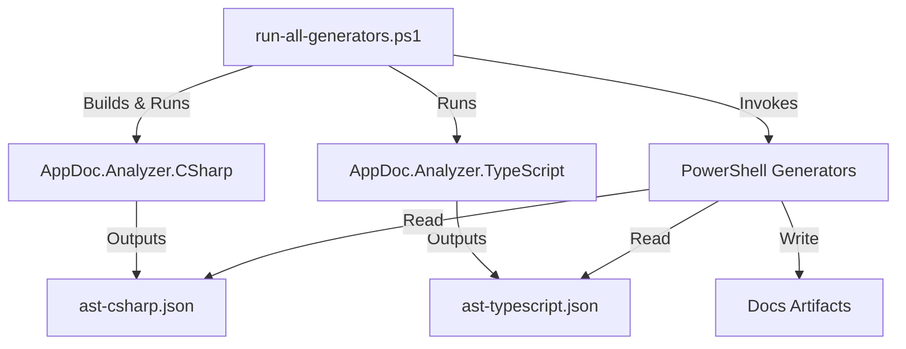

# Technical Implementation Plan

**Version:** 1.0.0
**Date:** 2026-02-25
**Status:** Approved for Execution

## 1. Executive Summary

This document outlines the technical strategy to upgrade the AppDoc framework from a regex-based documentation generator to a robust, AST-driven system. The goal is to address feedback regarding depth, accuracy, and usability by implementing a decoupled analysis engine and standardized presentation layer.

## 2. Architecture Upgrade: The "Analyzer Sidecar" Pattern

To enable deep code linking and accurate extraction without bloating the PowerShell scripts, we will introduce language-specific analyzers.

### 2.1. Component Diagram



### 2.2. The C# Analyzer (`.appdoc/tools/AppDoc.Analyzer.CSharp`)
*   **Technology**: .NET 8 Console Application.
*   **Dependencies**: `Microsoft.CodeAnalysis.CSharp`, `System.Text.Json`.
*   **Responsibility**:
    *   Parse `.sln` or `.csproj` files.
    *   Extract semantic models (not just syntax) to resolve types across files.
    *   Output a normalized JSON model.

### 2.3. The TypeScript Analyzer (`.appdoc/tools/AppDoc.Analyzer.TypeScript`)
*   **Technology**: Node.js script.
*   **Dependencies**: `ts-morph`.
*   **Responsibility**:
    *   Parse `tsconfig.json`.
    *   Extract exported classes, interfaces, and functions.
    *   Output normalized JSON model matching the C# schema.

## 3. Detailed Implementation by Artifact

### 3.1. API Inventory (`api-inventory.md`)
*   **Current State**: Regex scanning for `[HttpGet]`.
*   **New Implementation**:
    1.  **Input**: `ast-csharp.json` (Endpoints array).
    2.  **Logic**:
        *   Iterate over endpoints.
        *   **Auth**: Check for `[Authorize]` attribute on Controller or Method.
        *   **Examples**: Generate `curl` string: `curl -X {Method} {BaseUrl}/{Route} -H "Authorization: Bearer {Token}"`.
        *   **Linking**: Use `FilePath` and `LineNumber` from AST to create `View Code`.
    3.  **Template Update**: Add "Usage Example" and "Code Link" columns.

### 3.2. Data Model (`data-model.md`)
*   **Current State**: Regex scanning for `class`.
*   **New Implementation**:
    1.  **Input**: `ast-csharp.json` (Models array).
    2.  **Logic**:
        *   **ER Diagram**: Build Mermaid string.
            *   For each model `M`:
            *   For each property `P`:
            *   If `P.Type` exists in Models list, add `M ||--|| P.Type : "has"`.
        *   **Examples**: Look for `new Model { ... }` in Test ASTs to find instantiation examples.
    3.  **Template Update**: Embed `mermaid` block.

### 3.3. Configuration Catalog (`config-catalog.md`)
*   **Current State**: Regex scanning for `appsettings.json`.
*   **New Implementation**:
    1.  **Input**: `appsettings.json` + `ast-csharp.json` (ConfigUsage array).
    2.  **Logic**:
        *   Flatten `appsettings.json` keys.
        *   Match keys against `Configuration["Key"]` usage in AST.
        *   If match found, populate "Code Reference".
    3.  **Output**: Generate `docs/config-catalog.json` (machine readable) + Markdown.

### 3.4. Build Cookbook (`build-cookbook.md`)
*   **Current State**: Regex scanning for commands.
*   **New Implementation**:
    1.  **Input**: `.github/workflows/*.yml`, `package.json`, `*.csproj`.
    2.  **Logic**:
        *   **Quick Build**: If `package.json` exists, extract `scripts.build`. If `*.sln` exists, default to `dotnet build`.
        *   **Matrix**: Extract `runs-on` and `matrix` from GitHub Actions YAML.
    3.  **Template Update**: Add "Quick Build" section at top.

## 4. Cross-Cutting Improvements

### 4.1. Standardized Front Matter
Update `AppDoc.Generation.psm1` to inject:
```yaml
---
owner: {{Owner}}
last-updated: {{Date}}
audience: {{Audience}}
---
```

### 4.2. Evidence Summaries
Create `generate-evidence-summary.ps1`:
*   Reads all `evidence/*.json`.
*   Generates `docs/evidence/README.md` with high-level stats (e.g., "Total APIs: 15", "Total Debt Items: 4").

## 5. Migration Phases

### Phase 1: Tooling Bootstrap
*   Create `.appdoc/tools/` directory.
*   Implement `AppDoc.Analyzer.CSharp` skeleton.
*   Update `run-all-generators.ps1` to compile/run it.

### Phase 2: Data Model Pilot
*   Update C# Analyzer to extract Models.
*   Rewrite `generate-data-model.ps1` to use JSON input.
*   Verify ER diagram generation.

### Phase 3: API Inventory & Config
*   Update C# Analyzer to extract Endpoints and Config usage.
*   Rewrite `generate-api-inventory.ps1` and `generate-config-catalog.ps1`.

### Phase 4: Template & UX Polish
*   Apply new templates with Front Matter.
*   Implement `generate-evidence-summary.ps1`.
*   Update `index.md` and `start-here.md`.