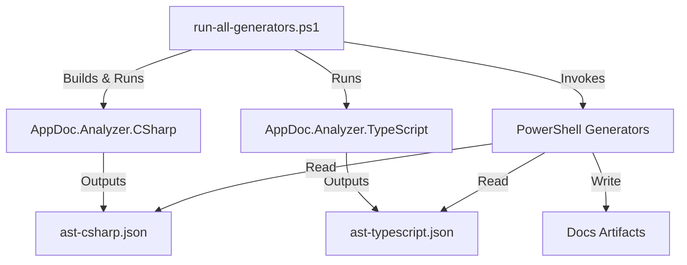

# Technical Implementation Plan

**Version:** 1.0.0
**Date:** 2026-02-25
**Status:** Approved for Execution

## 1. Executive Summary

This document outlines the technical strategy to upgrade the AppDoc framework from a regex-based documentation generator to a robust, AST-driven system. The goal is to address feedback regarding depth, accuracy, and usability by implementing a decoupled analysis engine and standardized presentation layer.

## 2. Architecture Upgrade: The "Analyzer Sidecar" Pattern

To enable deep code linking and accurate extraction without bloating the PowerShell scripts, we will introduce language-specific analyzers.

### 2.1. Component Diagram



### 2.2. The C# Analyzer (`.appdoc/tools/AppDoc.Analyzer.CSharp`)
*   **Technology**: .NET 8 Console Application.
*   **Dependencies**: `Microsoft.CodeAnalysis.CSharp`, `System.Text.Json`.
*   **Responsibility**:
    *   Parse `.sln` or `.csproj` files.
    *   Extract semantic models (not just syntax) to resolve types across files.
    *   Output a normalized JSON model.

### 2.3. The TypeScript Analyzer (`.appdoc/tools/AppDoc.Analyzer.TypeScript`)
*   **Technology**: Node.js script.
*   **Dependencies**: `ts-morph`.
*   **Responsibility**:
    *   Parse `tsconfig.json`.
    *   Extract exported classes, interfaces, and functions.
    *   Output normalized JSON model matching the C# schema.

## 2.4. Resilience and Error Handling

### 2.4.1. Orchestrator-Level Error Detection and Recovery

**Objective**: Gracefully handle analyzer failures (compilation errors, missing dependencies, runtime exceptions) while maintaining documentation quality.

#### Error Detection
*   **Exit Code Monitoring**: Orchestrator (`run-all-generators.ps1`) shall capture exit codes from `AnalyzerCS.exe` and AnalyzerTS runner (Node.js).
    *   Exit code 0: Success.
    *   Exit code 1: Recoverable analyzer error (retry-worthy transient failures or gracefully degradable with automatic retry attempts; e.g., missing optional dependency, transient compilation failure). Implementers should attempt retries (up to 2 with exponential backoff), degrade functionality, or fallback as appropriate.
    *   Exit code 2-10: Reserved for defined system error categories:
        *   2: Out of memory
        *   3: File system error
        *   4: Permission denied
        *   5: Invalid arguments
        *   6: Timeout
        *   7-10: Reserved for future system errors
    *   Exit code 11-127: Other analyzer errors (non-critical/other; partial analysis failures that should trigger immediate fallback/continue without retry; e.g., partial parsing error in one file, non-retryable AST extraction failure). Implementers should trigger fallback or alert only, no retry.
    *   Exit code 128+: Only used when run-all-generators.ps1 is executed on PowerShell/Windows and may conflict with Unix signal-based codes for AnalyzerCS.exe and AnalyzerTS (Node.js) runner.
        *   **Note**: On Unix CI/CD, exit codes 128+ may indicate process termination by signal (e.g., SIGKILL = 137). Orchestrator must interpret 128+ codes as potential signal-based termination and log accordingly. Avoid using 128+ for custom system errors in cross-platform scripts. Refined semantics above guide implementers on retry/fallback behavior.
    *   **Cross-Platform Behavior**: Always document and map exit codes in logs; ensure orchestrator distinguishes between Windows/PowerShell and Unix conventions when handling 128+ codes.
*   **Stderr/Stdout Capture**: Capture full stderr and stdout streams from analyzer processes for diagnostic logging.
    *   Log to `.appdoc/logs/analyzer-{timestamp}.log`.
    *   Include command line, working directory, and environment variables in log entries.

#### Retry and Backoff Strategy
*   **Initial Attempt**: Run analyzer with standard configuration.
1.  **Cached AST Outputs**: If prior successful `ast-csharp.json` or `ast-typescript.json` exist in the workspace, reuse them if they are less than 24 hours old (configurable via `.appdoc/profile.json` field: `"cache.maxAgeHours"`).    1.  If `cacheClearOnRetry` flag is enabled in generation config, clear error logs in the project (e.g., `bin/Debug`, `obj` folders for C#; `node_modules/.cache` for TS). Otherwise, skip cache clearing.
    2.  Analyzer output must use isolated temporary directories (e.g., set `ANALYZER_OUTPUT_DIR` or use temp-dir API) to avoid writing to shared build folders.
    3.  Wait 2 seconds (exponential backoff: 2s, 4s, 8s for attempts 1, 2, 3).
    4.  Retry up to 2 times before falling back.
    5.  **Note**: Generation should not run concurrently with active builds or CI jobs if `cacheClearOnRetry` is enabled, as clearing shared folders may cause race conditions.
*   **Fallback Decision**: If analyzer fails after retries, proceed with fallback generation (see section 2.4.2).

### 2.4.2. Fallback Generation Flow

When AST generation fails, Generators shall consume alternate data sources:

1.  **Cached AST Outputs**: If prior successful `ast-csharp.json` or `ast-typescript.json` exist in the workspace, reuse them (timestamp-based validation to ensure they are not stale).
2.  **Regex-Based Fallback Parsing**: If no cache exists, Generators trigger a lightweight fallback:
    *   **C#**: Use existing regex patterns to extract basic metadata (classes, methods, `[HttpGet]` endpoints, properties).
    *   **TypeScript**: Use existing regex patterns to extract exported types, functions, and basic interface members.
3.  **Partial Success Merging**: If one analyzer succeeds and another fails:
    *   Use successful AST outputs directly.
    *   Mark failed analyzer output as "degraded" in schema metadata (see section 2.4.3).
    *   Merge regex-fallback data for the failed language with successful AST data, flagging fallback entries for reduced confidence scoring.
4.  **Diagnostic Output**: Emit warnings listing which modules/files used fallback data instead of AST-generated data.

### 2.4.3. AST JSON Schema Versioning and Migration

**Schema Version Field**: Every AST JSON output includes a top-level `"schemaVersion"` field (e.g., `"1.0.0"`):
```json
{
  "schemaVersion": "1.0.0",
  "language": "csharp",
  "metadata": {
    "analyzerVersion": "1.0.0",
    "generatedAt": "2026-02-25T10:30:00Z",
    "degradedMode": false,
    "degradedModules": []
  },
  "modules": [ ... ]
}
```

**Backward Compatibility**:
*   Generators shall accept multiple schema versions (1.0.0, future 1.1.0, etc.).
*   Add a `"deprecationWarnings"` array in the schema to alert consumers of future breaking changes.
*   When a schema version is unsupported, log a clear error and fall back to regex parsing.

**Forward Compatibility**:
*   Schema 1.0.0 defines required fields: `language`, `modules[]`, `metadata.analyzerVersion`.
*   Optional fields are safe to ignore by older consumers.
*   Add a `"minimumGeneratorVersion"` field so old Generators can detect incompatibility early.

### 2.4.4. Unit and Integration Test Plans

#### Unit Tests (for Analyzers)
*   **C# Analyzer Unit Tests**:
    1.  **Synthetic Projects**: Create small, self-contained `.csproj` files with known structure (e.g., 3 classes, 5 endpoints).
    2.  **Dependency Scenarios**:
        *   Missing NuGet packages: Verify error code 1 is returned and stderr logs package names.
        *   Incompatible .NET version: Verify compilation error is captured and serialized.
    3.  **Schema Validation**: Parse generated JSON, validate all required fields are present, validate schemaVersion matches expected.
*   **TypeScript Analyzer Unit Tests**:
    1.  **Synthetic Projects**: Create small TypeScript project with known types and exports.
    2.  **Missing Dependency Scenarios**: Remove `ts-morph` or incompatible version; verify error handling.
    3.  **Schema Validation**: Same as C#.

#### Integration Tests (for Orchestrator + Analyzers + Fallback)
*   **Happy Path**: Run full pipeline on sample repo, verify AST outputs are generated and used by Generators.
*   **C# Analyzer Failure**: Simulate analyzer crash (e.g., mock exit code 1), verify:
    *   Retry logic executes (log shows 2-3 attempts).
    *   Fallback to regex parsing occurs.
    *   Final artifact is generated with degraded-mode flag.
*   **Partial Success**: One analyzer succeeds, other fails (e.g., TS fails but C# succeeds):
    *   Verify successful AST is used for C#.
    *   Verify fallback is used for TS.
    *   Verify merged output in artifact is consistent.
*   **Schema Round-Trip**: Parse generated AST JSON, validate fields, modify schemaVersion, re-parse, verify compatibility handling.
*   **Stale Cache**: Place old `ast-typescript.json` (>24 hours old), trigger analyzer with `--no-cache` flag, verify fresh generation and timestamp comparison.

#### Performance Benchmarks
*   Baseline: Analyzer runtime on sample projects (target < 5s for C#, < 3s for TS).
*   Fallback overhead: Regex parsing should complete in < 2s.
*   Retry penalties: Total time with 3 retries and backoff should not exceed 20s.

## 3. Detailed Implementation by Artifact

### 3.1. API Inventory (`api-inventory.md`)
*   **Current State**: Regex scanning for `[HttpGet]`.
*   **New Implementation**:
    1.  **Input**: `ast-csharp.json` (Endpoints array), `appsettings.json` or template configuration.
    2.  **Curl Generation Logic**:
        *   **BaseUrl Resolution**:
            *   Attempt to extract BaseUrl from `appsettings.json` (look for `"BaseUrl"`, `"ServiceUrl"`, or `"ApiRootPath"` keys).
            *   If not found, use template-configurable default (e.g., `https://api.example.com`, clearly marked as placeholder).
            *   Configurable via `.appdoc/profile.json` field: `"apiDocumentation.baseUrl"`.
            *   Fallback to deterministic placeholder if Parameter name not in map (e.g., seeded GUID based on parameter name hash, or generic placeholder like "sample-{parameterName}").            *   Parse route for parameters like `{id}`, `{userId}`, `{resourceId}`.
            *   Substitute with example values inferred from Parameter metadata (e.g., `Parameter.Type == "int"` → use `"123"`; `Parameter.Type == "string"` → use `"sample-value"`).
            *   Maintain a configurable sample-values map in template settings:
                ```json
                "apiDocumentation.sampleValues": {
                  "id": "123",
                  "userId": "user-456",
                  "resourceId": "resource-789",
                  "name": "sample-name"
                }
                ```
            *   Fallback to GUID or incrementing counter if Parameter name not in map.
        *   **Request Body** (for POST/PUT/PATCH):
            *   If endpoint has a Body parameter, serialize its schema as a representative JSON object.
            *   Use schema default values where available; generate sample values (strings, numbers) for fields without defaults.
            *   Implement a schema traversal that handles nested objects and arrays (e.g., `List<Item>` → `[ { ...sample item... } ]`).
                *   Limit recursion depth to a configurable maximum (default: 3, set via `.appdoc/profile.json` key: `"apiDocumentation.maxSchemaDepth"`). When max depth is exceeded, emit the literal placeholder string `[Max depth exceeded]` for property values.
                *   Detect cycles/circular references; emit the literal placeholder string `[Circular reference to {TypeName}]` (substitute detected type name) instead of recursing for circular references.
                *   Limit arrays to produce a single sample item by default (configurable via `.appdoc/profile.json` key: `"apiDocumentation.maxArraySampleCount"`, default: 1). When arrays are truncated, the curl/example block should include a short inline note such as `# Array truncated to N items for brevity`.
                *   These rules apply to all nested object/array examples, including `List<Item>` and `CreateUserModel`.
                *   Configuration keys and defaults:
                    *   `apiDocumentation.maxSchemaDepth`: default 3
                    *   `apiDocumentation.maxArraySampleCount`: default 1
            *   Example: `POST /users` with body parameter `CreateUserModel { Name: string, Age: int }` → include `-d '{"name": "John Doe", "age": 30}'`.
        *   **Authorization Handling**:
            *   Inspect endpoint and controller metadata for auth attributes (`[Authorize]`, `[AllowAnonymous]`, etc.) and auth schemes (`[Authorize(AuthenticationSchemes = "Bearer")]`, custom schemes).
            *   **Supported Schemes**:
                *   **Bearer Token** (default OAuth2 pattern): `curl -X {Method} {BaseUrl}{Route} -H "Authorization: Bearer {{TOKEN_PLACEHOLDER}}"`
                *   **API Key**: Detect via `[ApiKey]` attribute or config; render as `-H "X-API-Key: {{API_KEY_PLACEHOLDER}}"` (header name configurable).
                *   **Basic Auth**: If metadata indicates `AuthenticationSchemes = "Basic"`, render as `-H "Authorization: Basic {{BASE64_CREDENTIALS_PLACEHOLDER}}"` with comment.
                *   **OAuth/Custom Headers**: Inspect endpoint metadata for custom auth headers and render corresponding headers/comments.
            *   **Placeholder Tokens**: Use consistent placeholders (e.g., `{{BEARER_TOKEN}}`, `{{API_KEY}}`) that documentation viewers can find and replace with real credentials.
            *   If endpoint is `[AllowAnonymous]`, omit auth header but include comment `# No authentication required`.
        *   **Examples**:
            ```bash
            # GET Endpoint
            curl -X GET "https://api.example.com/api/users/123" \
              -H "Authorization: Bearer {{BEARER_TOKEN}}"
            
            # POST Endpoint with Body
            curl -X POST "https://api.example.com/api/users" \
              -H "Authorization: Bearer {{BEARER_TOKEN}}" \
              -H "Content-Type: application/json" \
              -d '{"name": "John Doe", "email": "john@example.com", "age": 30}'
            
            # API Key Auth
                        curl -X GET "https://api.example.com/api/data" \
                            -H "X-API-Key: {{API_KEY}}"
                        ```
                *   **Linking**: Use `FilePath` and `LineNumber` from AST to create a deterministic "View Code" link. The link format is now configurable via the `codeLinkFormat` setting in `.appdoc/profile.json`:
                        *   Example: `[View Code](https://github.com/org/repo/blob/main/{filePath}#L{line})` for GitHub, `[View Code](https://gitlab.com/org/repo/-/blob/main/{filePath}?line={line})` for GitLab, etc.
                        *   At runtime, load and validate the `codeLinkFormat` template, substituting `{baseUrl}`, `{filePath}`, `{lineAnchor}` or `{line}` as needed.
                        *   This enables support for GitHub, GitLab, Bitbucket, Azure DevOps, and custom VCS flavors without changing generator code.
                        *   If `codeLinkFormat` is missing, default to GitHub-style anchor (`{baseUrl}/{filePath}#L{line}`).
                        *   Example config:
                                ```json
                                {
                                    "codeLinkFormat": "{baseUrl}/{filePath}#L{line}"
                                }
                                ```
                        *   When constructing View Code links, always apply the loaded template and validate substitutions.
        3.  **Template Configuration** (`.appdoc/profile.json`):
        ```json
        {
          "apiDocumentation": {
            "enabled": true,
            "baseUrl": "https://api.example.com",
            "includeRequestBody": true,
            "includeSampleValues": true,
            "sampleValues": {
              "id": "123",
              "userId": "user-456",
              "email": "user@example.com"
            },
            "authSchemes": {
              "bearerTokenHeader": "Authorization",
              "apiKeyHeader": "X-API-Key",
              "bearerPlaceholder": "{{BEARER_TOKEN}}",
              "apiKeyPlaceholder": "{{API_KEY}}"
            },
            "codeLinkBasePath": "../src/",
            "deterministic": true
          }
        }
        ```
    4.  **Determinism and Configurability**:
        *   All curl examples and code links are generated deterministically: same input → same output, always.
        *   Consumers can override placeholders, sample values, and base URLs via template configuration without re-generating AST.
        *   Configuration overrides are validated at template render time; invalid or missing values fall back to sensible defaults.
    5.  **Template Update**: Add "Usage Example", "Authorization Required", "Request Body", and "Code Link" columns/sections.

### 3.2. Data Model (`data-model.md`)
*   **Current State**: Regex scanning for `class`.
*   **New Implementation**:
    1.  **Input**: `ast-csharp.json` (Models array).
    2.  **Logic**:
        *   **ER Diagram**: Build Mermaid string from Models array with relationship detection.
            *   For each model `M`:
                *   **Inheritance Detection**: If `M.BaseClass` or `M.Interfaces` (array) present, emit `M --|> BaseClass` (inheritance) and `M ..|> InterfaceName` (interface implementation) for each interface.
                *   For each property `P`:
                    *   **Type Analysis**: Use Roslyn semantic model (Microsoft.CodeAnalysis.CSharp) to resolve `P.Type` to an `ITypeSymbol`.
                        *   Unwrap generic type arguments recursively (e.g., `Dictionary<string,List<User>>` → `List<User>` → `User`).
                        *   Detect tuple types and emit tuple relationships.
                        *   Distinguish `Nullable<T>` (value types) vs nullable reference types.
                        *   Honor generic constraints and resolve actual referenced types.
                    *   **Collection Types**: If resolved symbol is a collection (implements `IEnumerable<T>`), extract inner type and emit `M ||--o{ T : "has many"` (one-to-many).
                    *   **Nullable Types**: If resolved symbol is `Nullable<T>` or nullable reference type, emit `M ||--o| T : "may have"` (zero-or-one).
                    *   **Tuple Types**: Emit relationships for each tuple element type.
                    *   **Single Types**: If resolved symbol exists in Models list and is not collection/nullable/tuple, emit `M ||--|| T : "has"` (one-to-one).
                    *   **No Relationship**: If resolved symbol is primitive or not in Models list, skip relationship generation but include property in data-model details.
            *   **Note**: Remaining known limitations: cannot resolve dynamic/anonymous types, some deeply nested generics may be missed, and cross-assembly references may require additional symbol resolution.
        *   **Examples Discovery**: Scan Models array for those marked with `isTestModel: true` or files with test metadata, then traverse AST for:
            *   **ObjectCreation Nodes**: Find `new M { property = value }` patterns in test files.
            *   **Initializer Nodes**: Find collection/property initializers referencing model names.
            *   Extract and deduplicate examples; limit to 2-3 per model.
        *   **Evidence Linking**: For each model, record file path, line number, and namespace to enable code lookup.
    3.  **Template Update**: Embed `mermaid` block with legend explaining relationship cardinalities (||--||, ||--o|, ||--o{, --|>, ..|>).

### 3.3. Configuration Catalog (`config-catalog.md`)

*   **Current State**: Regex scanning for `appsettings.json` and `Configuration["Key"]` usage.
*   **Phased Implementation**:
    *   **Phase 1**: DirectAccess detection and appsettings.json flattening
        *   Detect `Configuration["Key"]` usage (DirectAccess).
        *   Flatten appsettings.json and environment-specific overrides.
        *   Output: Catalog with schemaVersion, configurationKeys (DirectAccess only), unusedSources.
        *   Only match/merge DirectAccess and flattened keys; tests and docs/config-catalog.json validate this subset.
    *   **Phase 2**: IOptionsBinding and EnvironmentVariable normalization/matching
        *   Detect strongly-typed `IOptions<T>` bindings (IOptionsBinding).
        *   Detect environment variable reads (EnvironmentVariable).
        *   Normalize env var names (`__` → `:`), match against flattened keys, preserve appsettings casing.
        *   Output: Catalog with schemaVersion, configurationKeys (DirectAccess, IOptionsBinding, EnvironmentVariable), unusedSources.
        *   Matching/merging logic limited to these types; tests/docs validate incremental output.
    *   **Phase 3**: ExternalProvider, UserSecret, and BindMethod support
        *   Detect external provider usages (ExternalProvider), user-secrets references (UserSecret), and configuration binding methods (BindMethod).
        *   Merge provider keys, user-secrets, and binding methods into catalog.
        *   Output: Catalog with schemaVersion, configurationKeys (all types), unusedSources.
        *   Matching/merging logic expanded to all types; tests/docs validate full output.
    *   For each phase, produce incremental outputs following the catalog schema and ensure matching/merging logic is limited to the currently implemented types so tests and docs/config-catalog.json generation can be validated early before adding later providers.
    *   **Catalog Schema** (`docs/config-catalog.json`):
        ```json
        {
          "schemaVersion": "1.0.0",
          "configurationKeys": [
            {
              "key": "Database:ConnectionString",
              "description": "Primary database connection string",
              "sources": ["appsettings.json", "Environment Variable", "User Secret"],
              "environmentVariableName": "DATABASE__CONNECTIONSTRING",
              "codeReferences": [
                {
                  "kind": "IOptionsBinding",
                  "symbol": "DatabaseOptions",
                  "filePath": "src/Services/DatabaseService.cs",
                  "lineNumber": 45
                },
                {
                  "kind": "DirectAccess",
                  "symbol": "Configuration",
                  "filePath": "src/Startup.cs",
                  "lineNumber": 102
                }
              ],
              "externalProviderRefs": [
                {
                  "provider": "AzureKeyVault",
                  "secretName": "DbConnectionString",
                  "filePath": "src/Program.cs",
                  "lineNumber": 15
                }
              ],
              "type": "string",
              "isRequired": true,
              "example": "server=prod-db.example.com;database=MyApp;..."
            }
          ],
          "unusedSources": [
            {
              "source": "Environment Variable",
              "key": "LEGACY__SETTING",
              "normalizedKey": "LEGACY:SETTING",
              "reason": "No code reference found"
            }
          ]
        }
        ```

    6.  **Output**:
        *   `docs/config-catalog.json` (machine readable, full details).
        *   `docs/config-catalog.md` (human readable):
            *   Table: Key, Description, Sources, Code Reference (links to source files with line numbers), External Provider, Type, Required, Example.
            *   Section: "Environment Variables" (list all applicable env var names with normalization notes).
            *   Section: "External Providers" (Azure KeyVault, AWS Secrets Manager, custom providers).
            *   Section: "User Secrets" (if applicable, identify which keys can be overridden).
            *   Section: "Unused Configuration" (diagnostic: config keys detected but not used in code).
            *   Section: "IOptions Types" (list all `IOptions<T>` and their bound sections).

    7.  **Determinism and Validation**:
        *   All config keys are sorted alphabetically in output for reproducibility.
        *   All file paths and line numbers are relative to repo root.
        *   Environment variable case is preserved as found in code; normalizations are shown.
        *   External provider integrations are validated to ensure correct client construction and usage patterns.

### 3.4. Build Cookbook (`build-cookbook.md`)
*   **Current State**: Regex scanning for commands.
*   **New Implementation**:
    1.  **Input**: `.github/workflows/*.yml`, `package.json`, `*.csproj`.
    2.  **Logic**:
        *   **Quick Build**: If `package.json` exists, extract `scripts.build`. If `*.sln` exists, default to `dotnet build`.
        *   **Matrix**: Extract `runs-on` and `matrix` from GitHub Actions YAML.
    3.  **Template Update**: Add "Quick Build" section at top.

## 4. Cross-Cutting Improvements

### 4.1. Standardized Front Matter

**Front Matter Template**:
```yaml
---
owner: {{Owner}}
last-updated: {{Date}}
audience: {{Audience}}
---
```

**Template Variable Resolution**:

#### {{Owner}}
*   **Source Resolution** (in priority order):
    1.  **CLI Flag**: `--DocumentationOwner "John Doe <john@example.com>"` (if provided to `run-all-generators.ps1`).
    2.  **Environment Variable**: `$env:APPDOC_OWNER`.
    3.  **Configuration File**: `.appdoc/profile.json` field: `"generated.owner"`.
    4.  **Repository Metadata**:
        *   Check for `CODEOWNERS` file in repo root; use robust parser:
            1. Read CODEOWNERS file, skip blank lines and comment lines starting with '#'.
            2. Search for a default pattern entry (line whose pattern is '*' or bare wildcard); if absent, use first non-comment entry.
            3. Split owners field on whitespace to handle multiple owners; return the first owner.
            4. If no valid entry found, fall back to `git config user.name` + `git config user.email`.
    5.  **Default Fallback**: `"Documentation Team"`.
*   **Implementation Site**: Function `Get-AppDocGenerationOwner` in `AppDoc.Generation.psm1` shall perform the above resolution and return a string.

#### {{Date}}
*   **Timestamp Strategy** (pick one, document choice in `.appdoc/profile.json`):
    *   **Option A (Recommended)**: Generation timestamp at script execution time.
        *   Value: `Get-Date -Format "yyyy-MM-ddTHH:mm:ssK"` (ISO 8601 format with timezone).
        *   Rationale: Reflects when the documentation was built.
    *   **Option B (Alternative)**: Last commit date of the repository.
        *   Value: `git log -1 --format="%aI"` (if in a git repo; fall back to Option A if not).
        *   Rationale: Ties documentation to repository state.
*   **Configuration**: Set strategy in `.appdoc/profile.json` field: `"generated.dateSource": "execution"` or `"lastCommit"`.
*   **Override**:
    *   CLI Flag: `--DocumentationDate "2026-02-25T12:00:00+00:00"` (ISO 8601 format).
    *   Environment Variable: `$env:APPDOC_DATE`.
*   **Implementation Site**: Function `Get-AppDocGenerationDate` in `AppDoc.Generation.psm1` shall perform resolution based on config and return a formatted string.

#### {{Audience}}
*   **Source Resolution** (in priority order):
    1.  **CLI Flag**: `--DocumentationAudience "architect"` (if provided).
    2.  **Environment Variable**: `$env:APPDOC_AUDIENCE`.
    3.  **Configuration File**: `.appdoc/profile.json` field: `"generated.audience"`.
    4.  **Default Fallback**: `"developer"`.
*   **Allowed Values**: `"developer"`, `"architect"`, `"operator"`, `"stakeholder"` (or custom per profile).
*   **Impact**: Influences tonality, detail level, and sections included (e.g., architects see system design, operators see deployment details).
*   **Implementation Site**: Function `Get-AppDocGenerationAudience` in `AppDoc.Generation.psm1` shall validate and return the resolved audience.

**Configuration Structure** (`.appdoc/profile.json`):
```json
{
  "generated": {
    "owner": "Documentation Team",
    "dateSource": "execution",
    "audience": "developer",
    "timezone": "UTC"
  }
}
```

**Override Precedence** (highest to lowest):
1.  CLI flags (`--DocumentationOwner`, `--DocumentationDate`, `--DocumentationAudience`).
2.  Environment variables (`$env:APPDOC_OWNER`, `$env:APPDOC_DATE`, `$env:APPDOC_AUDIENCE`).
3.  Configuration file (`.appdoc/profile.json`).
4.  Repository metadata (git config, CODEOWNERS).
5.  Hardcoded defaults.

**Integration in `AppDoc.Generation.psm1`**:
*   **Function**: `Invoke-AppDocFrontMatterInjection -RootPath <path> -Owner <owner> -Date <date> -Audience <audience>`
    *   Reads all generated Markdown files in `docs/`.
    *   Prepends front matter with resolved variables (or updates existing front matter).
    *   Ensures consistent formatting and encoding (UTF-8).
    *   Called automatically by `Write-AppDocArtifact` and other generation functions.
*   **Supporting Functions** (public):
    *   `Get-AppDocGenerationOwner [-Overr <override>] [-Profile <config>]`
    *   `Get-AppDocGenerationDate [-Overr <override>] [-DateSource <"execution"|"lastCommit">]`
    *   `Get-AppDocGenerationAudience [-Override <override>] [-Profile <config>]`

**Pre-Flight Repository Cleanliness Check**:
*   When `dateSource` is set to `"lastCommit"`, the orchestrator (`run-all-generators.ps1`) shall execute a repository status check at startup.
*   **Check Logic**:
    *   Detect git repository by testing for `.git` directory or running `git rev-parse --is-inside-work-tree`.
    *   If detected, attempt to retrieve last commit date via `git log -1 --format="%aI"`.
    *   If not a git repo, git not installed, or git command fails, fall back to Option A (execution timestamp) and emit a non-fatal warning to the user.
    *   Edge cases:
        *   Detached HEAD: Warn that commit date may reflect a non-branch state.
        *   Shallow clone: Warn that commit date may be unavailable or reflect shallow history.
    *   Repository cleanliness: Execute `git status --porcelain` from the repository root to detect uncommitted changes.
*   **Configuration**: New boolean flag in `.appdoc/profile.json` controls behavior: `"generated.verifyCleanRepo"` (default: `true`).
*   **Behavior**:
    *   Parse `git status --porcelain` output in `Assert-AppDocRepositoryClean`:
        *   Classify entries by prefix: "M", "A", "D", staged files = dirty; "??" = untracked.
        *   If `generated.verifyCleanRepo` is `true` and dirty files detected: log error with details and abort generation with exit code 15 ("Repository not clean").
        *   If `generated.verifyCleanRepo` is `false` and dirty files detected: log warning listing changed files but continue generation.
        *   Untracked files ("??") are treated as non-fatal warnings by default; emit a detailed log listing file paths and change types and rationale.
        *   Optional config flag `generated.treatUntrackedAsDirty` (default: false) allows making untracked files fatal if desired.
    *   **Error Message**: Include detected file paths, types of changes (modified, added, deleted, staged, untracked), rationale (e.g., "lastCommit date strategy requires clean repository state for reproducibility"), and any fallback or edge case warnings. Document config keys in `.appdoc/profile.json`.
*   **Implementation Site**: Function `Assert-AppDocRepositoryClean` in `AppDoc.Generation.psm1`; called at orchestrator entrypoint if `dateSource` is `"lastCommit"`.
*   **Configuration Example**:
    ```json
    {
      "generated": {
        "dateSource": "lastCommit",
        "verifyCleanRepo": true
      }
    }
    ```

**Determinism Note**:
*   Front matter values are deterministic when generation timestamp is chosen (same input + same config → same output).
*   If using last-commit-date strategy, ensure repository state is clean (all changes committed) before generation for reproducibility. Use the pre-flight check configured via `verifyCleanRepo` flag.

### 4.2. Evidence Summaries
Create `generate-evidence-summary.ps1`:
*   Reads all `evidence/*.json`.
*   Generates `docs/evidence/README.md` with high-level stats (e.g., "Total APIs: 15", "Total Debt Items: 4").

## 5. Migration Phases

### Phase 1: Tooling Bootstrap

**Objective**: Establish foundation for AST-driven analysis by implementing the C# analyzer and orchestrator integration.

**Tasks**:
*   Create `.appdoc/tools/` directory structure and NuGet project.
*   Implement `AppDoc.Analyzer.CSharp` skeleton (basic project parsing).
*   Update `run-all-generators.ps1` to detect, compile, and run `AppDoc.Analyzer.CSharp`.
*   Create fallback logic (retry + regex degradation) in orchestrator.
*   Establish logging and diagnostic output for analyzer errors.

**Deliverables**:
*   `.appdoc/tools/AppDoc.Analyzer.CSharp/` with working console app.
*   `ast-csharp.json` schema version 1.0.0 with basic metadata.
*   Updated `run-all-generators.ps1` with error handling and fallback.

**Completion Criteria / Acceptance Tests**:
1.  ✅ `AppDoc.Analyzer.CSharp` compiles successfully on .NET 8+ without warnings.
2.  ✅ Console app accepts `--solutionPath` argument and produces `ast-csharp.json` to stdout/file.
3.  ✅ Exit code 0 on success; exit code 1 on recoverable error (missing project, compilation error).
4.  ✅ Orchestrator detects exit code and retries up to 2 times with backoff.
5.  ✅ On final failure, falls back to regex parsing without crashing.
6.  ✅ Analyzer runs on sample 3-project solution and produces valid JSON (schemaVersion = "1.0.0").
7.  ✅ stderr/stdout logged to `.appdoc/logs/analyzer-phase1-*.log`.
8.  ✅ Execution time on sample solution < 5 seconds.

**Timeline**: 3-4 weeks.
**Owner**: Lead Engineer (Backend/DevOps).
**Dependencies**: .NET 8 SDK, Microsoft.CodeAnalysis.CSharp.

**Rollback Plan**:
*   If analyzer fails: Keep regex-based generation as default; mark AST as experimental in `run-all-generators.ps1` with `--UseAST` flag (opt-in).
*   Validation: Run `run-all-generators.ps1` on 2-3 sample projects without `--UseAST`; verify regex fallback generates identical artifacts to pre-Phase-1 baseline.
*   Timeline: 1-2 hours.

**Performance Benchmark**:
*   Analyzer runtime: < 5 seconds for projects with ≤ 10,000 lines of code.
*   Fallback (regex): < 2 seconds for projects with ≤ 10,000 lines of code.
*   Orchestrator overhead (retry/logging): < 1 second.
*   Target: Total runtime on typical project < 10 seconds.

---

### Phase 2: Data Model Pilot

**Objective**: Validate AST-based extraction and Mermaid ER diagram generation using C# analyzer.

**Tasks**:
*   Extend `AppDoc.Analyzer.CSharp` to extract class definitions, properties, relationships, and generic types.
*   Populate `ast-csharp.json` Models array with full metadata (name, namespace, properties, base types).
*   Rewrite `generate-data-model.ps1` to consume `ast-csharp.json` instead of regex.
*   Implement Mermaid ER diagram generation from Models array.
*   Add front matter and evidence linking.

**Deliverables**:
*   Extended `ast-csharp.json` with Models array.
*   Updated `generate-data-model.ps1` (PowerShell module).
*   `docs/data-model.md` with embedded Mermaid ER diagram.
*   `docs/evidence/data-model.evidence.json` with code references.

**Completion Criteria / Acceptance Tests**:
1.  ✅ Analyzer extracts all public classes from sample projects.
2.  ✅ Extracted class metadata includes: name, namespace, properties (name, type), base classes, generic type parameters.
3.  ✅ Props correctly resolved for generic types (e.g., `List<User>` → captures `User` as referenced type).
4.  ✅ Mermaid ER diagram generated with no syntax errors.
5.  ✅ ER diagram relationships match manual inspection for 3 sample projects (manual spot-check by reviewer).
6.  ✅ `data-model.md` front matter includes owner, date, audience (deterministic).
7.  ✅ Evidence linking: Each class in diagram has clickable "View Code" link (file + line number).
8.  ✅ Runtime on sample project (50+ classes) < 3 seconds.
9.  ✅ Output deterministic: Identical input always produces byte-for-byte identical `data-model.md` and evidence JSON.

**Timeline**: 2-3 weeks.
**Owner**: Lead Engineer (Backend) + Technical Writer.
**Dependencies**: Phase 1 completion, Mermaid documentation.

**Rollback Plan**:
*   If ER diagram generation is broken: Revert `generate-data-model.ps1` to previous regex-based version in git history.
*   Validation: Compare `docs/data-model.md` output from rollback vs. pre-Phase-2 baseline (should be identical).
*   Timeline: 30 minutes.

**Performance Benchmark**:
*   Model extraction: < 2 seconds for 100+ classes.
*   Mermaid generation: < 1 second for 50-class diagram.
*   PowerShell processing: < 2 seconds.
*   Target: Total `data-model.md` generation < 5 seconds.

---

### Phase 3: API Inventory & Configuration Catalog

**Objective**: Complete AST extraction for endpoints and configuration, enabling API documentation and config catalog generation.

**Tasks**:
*   Extend `AppDoc.Analyzer.CSharp` to extract HTTP endpoints (GET, POST, PUT, DELETE, PATCH) with routes, parameters, auth attributes, and method signatures.
*   Extend to extract configuration usage (IOptions, Configuration["Key"], environment vars, user-secrets, external providers).
*   Rewrite `generate-api-inventory.ps1` to use endpoint metadata and generate curl examples.
*   Rewrite `generate-config-catalog.ps1` to match config usage against flattened keys and generate comprehensive catalog.
*   Implement code linking (file paths, line numbers) for all references.

**Deliverables**:
*   Extended `ast-csharp.json` with Endpoints and ConfigUsage arrays.
*   Updated `generate-api-inventory.ps1` (PowerShell module).
*   Updated `generate-config-catalog.ps1` (PowerShell module).
*   `docs/api-inventory.md` with curl examples and code links.
*   `docs/config-catalog.md` and `docs/config-catalog.json`.
*   Evidence JSON files for both artifacts.

**Completion Criteria / Acceptance Tests**:
1.  ✅ Analyzer extracts all public HTTP endpoints with: route, HTTP method, parameters (name, type), return type, auth attributes.
2.  ✅ Curl examples generated deterministically with correct method, route, and sample parameters.
3.  ✅ Authorization headers rendered correctly:
    *   Bearer Token endpoints: `-H "Authorization: Bearer {{BEARER_TOKEN}}"`.
    *   API Key endpoints: `-H "X-API-Key: {{API_KEY}}"`.
    *   [`AllowAnonymous`] endpoints: No auth header, comment `# No authentication required`.
4.  ✅ Configuration keys from appsettings.json, env vars, and user-secrets all detected and matched.
5.  ✅ IOptions<T> bindings identified and linked in catalog.
6.  ✅ External provider calls (Azure KeyVault, AWS Secrets Manager) detected and recorded.
7.  ✅ Config catalog JSON schema valid (schemaVersion = "1.0.0").
8.  ✅ Code references in catalog are accurate: file path and line number verified spot-check (3+ projects).
9.  ✅ Runtime on sample ASP.NET Core project (20+ endpoints, 50+ config keys) < 5 seconds.
10. ✅ All output deterministic (sorted keys, consistent formatting).

**Timeline**: 3-4 weeks.
**Owner**: Lead Engineer (Backend) + Technical Writer + DevOps.
**Dependencies**: Phase 1 and 2 completion, appsettings schema understanding.

**Rollback Plan**:
*   If endpoint extraction broken: Revert `generate-api-inventory.ps1` to regex-based version.
*   If config matching broken: Revert `generate-config-catalog.ps1` to previous simpler version (direct key match only).
*   Validation: Run both regenerated files; compare against pre-Phase-3 baseline (allowing deterministic variance in run metadata).
*   Timeline: 45 minutes.

**Performance Benchmark**:
*   Endpoint extraction: < 2 seconds for 100+ endpoints.
*   Configuration extraction: < 2 seconds for 100+ config keys.
*   Curl generation: < 1 second for 20 endpoints.
*   Config catalog generation: < 2 seconds.
*   Total runtime on large project: < 10 seconds.

---

### Phase 3.5: TypeScript Analyzer Implementation (Parallel Stream)

**Objective**: Implement language parity for TypeScript projects alongside Phase 3 C# work.

**Tasks**:
*   Create `.appdoc/tools/AppDoc.Analyzer.TypeScript/` Node.js project using `ts-morph` and TypeScript compiler API.
*   Implement AST extraction for exported types, interfaces, classes, and functions matching C# schema structure.
*   Extract NestJS/Express endpoints (decorators: `@Get()`, `@Post()`, etc.), parameter types, and auth metadata.
*   Implement configuration detection (environment variables, `.env`, config files, external providers).
*   Populate `ast-typescript.json` with schema version 1.0.0 matching C# format.
*   Update `run-all-generators.ps1` to detect, run, and fallback TS analyzer.
*   Create dedicated Node.js runner wrapper compatible with PowerShell orchestrator.

**Deliverables**:
*   `.appdoc/tools/AppDoc.Analyzer.TypeScript/` with npm package structure.
*   `AppDoc.Analyzer.TypeScript.ps1` wrapper script (calls Node.js runner).
*   `ast-typescript.json` matching C# schema.
*   Updated `run-all-generators.ps1` with TS analyzer integration and fallback.

**Completion Criteria / Acceptance Tests**:
1.  ✅ Node.js analyzer accepts `--projectPath` (or tsconfig path) and produces `ast-typescript.json` to stdout/file.
2.  ✅ Exit codes: 0 (success), 1 (recoverable error like missing tsconfig), 128+ (system error).
3.  ✅ Extracts all exported types, interfaces, classes from project.
4.  ✅ For NestJS projects: Detects controller and route decorators with correct HTTP methods and parameters.
5.  ✅ Environment variable detection (`process.env.KEY`, `dotenv`) working correctly.
6.  ✅ `ast-typescript.json` schema valid and matches C# schema structure.
7.  ✅ Runtime on sample TypeScript project (100+ types, 20+ endpoints) < 3 seconds.
8.  ✅ Fallback to regex parsing works when analyzer unavailable.
9.  ✅ Orchestrator successfully chains C# + TS analyzers without blocking.
10. ✅ Both `ast-csharp.json` and `ast-typescript.json` present in docs/evidence/ after successful run.

**Timeline**: 3-4 weeks (parallel to Phase 3).
**Owner**: Lead Engineer (Frontend/Node) + DevOps.
**Dependencies**: Phase 1 completion (orchestrator), ts-morph and TypeScript compiler understanding.

**Rollback Plan**:
*   If TS analyzer fails: Mark as "experimental" or disabled in `run-all-generators.ps1` (environment flag: `APPDOC_SKIP_TS_ANALYZER`).
*   Validation: Run without TS analyzer; verify only C# docs generated (no .ts-related errors or empty TS files).
*   Timeline: 30 minutes.

**Performance Benchmark**:
*   TS analyzer runtime: < 3 seconds for projects with ≤ 10,000 lines of TypeScript.
*   Fallback: < 2 seconds.
*   Orchestrator overhead: < 1 second per analyzer.
*   Target: Total TS processing < 5 seconds on typical project.

---

### Phase 4: Template & UX Polish

**Objective**: Apply refined templates, front matter, and evidence summaries to produce production-ready documentation.

**Tasks**:
*   Create/update Handlebars templates for all artifacts with front matter, styling, and evidence linking.
*   Implement `generate-evidence-summary.ps1` to aggregate all evidence JSON files and emit dashboard stats.
*   Update `index.md` with navigation, overview, and latest generation metadata.
*   Update `start-here.md` with quick links and onboarding guide.
*   Perform full end-to-end testing on 3+ diverse sample projects (C#-only, TS-only, mixed).
*   Tag v1.0.0 and release.

**Deliverables**:
*   Refined Markdown templates (all 8 artifacts).
*   `generate-evidence-summary.ps1` (PowerShell module).
*   Updated `index.md` and `start-here.md`.
*   Release v1.0.0 of AppDoc framework.
*   Comprehensive integration tests and CI/CD pipeline.

**Completion Criteria / Acceptance Tests**:
1.  ✅ All Markdown files have valid front matter (owner, date, audience).
2.  ✅ All code links resolve correctly (file path + line number).
3.  ✅ All curl examples are syntactically valid.
4.  ✅ All Mermaid diagrams render without errors.
5.  ✅ Evidence summary dashboard shows all 8 artifacts with counts (endpoints, models, config keys, etc.).
6.  ✅ `start-here.md` onboarding complete within 5 minutes for new user.
7.  ✅ Full end-to-end generation on 3 sample projects:
    *   Sample 1: C# ASP.NET Core only (20+ endpoints, 100+ models).
    *   Sample 2: TypeScript Node.js only (Express/NestJS, 15+ routes).
    *   Sample 3: Mixed C# + TypeScript monorepo.
8.  ✅ All outputs deterministic (byte-for-byte identical on re-run).
9.  ✅ All outputs sorted and formatted consistently.
10. ✅ No regressions vs. Phase 3 baselines (content quality and accuracy verified by manual review).
11. ✅ Total generation time on large mixed project (50+ endpoints, 200+ models, 100+ config keys) < 30 seconds.
12. ✅ CI/CD pipeline (GitHub Actions) successfully runs `run-all-generators.ps1` on every commit to `main`.

**Timeline**: 2-3 weeks.
**Owner**: Technical Writer + Lead Engineer + DevOps.
**Dependencies**: Phase 1, 2, 3, and 3.5 completion.

**Rollback Plan**:
*   If template changes broke output: Revert template files and regenerate using previous templates (version controlled in git).
*   If evidence summary is broken: Remove `generate-evidence-summary.ps1` call from orchestrator; docs still generate without dashboard.
*   Validation: Compare full output before and after rollback; verify identical on deterministic fields.
*   Timeline: 1 hour.

**Performance Benchmark**:
*   Template rendering: < 5 seconds for all 8 artifacts on typical project.
*   Evidence summary aggregation: < 2 seconds.
*   Full orchestration: < 30 seconds on large project.
*   Target: Single-run generation on any project < 1 minute.

---

### Cross-Phase Success Metrics

**Overall Criteria for v1.0.0 Release**:
1.  All analyzers (C# and TypeScript) working correctly with fallback logic.
2.  All 8 artifacts generated successfully with valid front matter, deterministic output, and evidence linking.
3.  Comprehensive test suite: unit tests (analyzers), integration tests (orchestrator + generators), acceptance tests (3+ sample projects).
4.  Documentation and runbooks for deployment, troubleshooting, and configuration.
5.  No critical bugs reported in 2-week community/internal testing period.

**Performance SLA for v1.0.0**:
*   Single artifact generation: < 3 seconds.
*   Full orchestration on typical project: < 30 seconds.
*   Full orchestration on large project (≥10K LOC, ≥50 endpoints):
    *   Local-only analysis (no external provider calls): < 60 seconds.
    *   External-provider-enabled analysis (e.g., Azure KeyVault, AWS Secrets Manager): < configurable target (default: 120 seconds; can be set via config).
    *   Note: External provider calls should use configurable timeouts (default: 5-10 seconds per call) and implement caching of provider responses to minimize repeated latency. Document timeout and cache defaults in `.appdoc/profile.json` and generation logs.

---